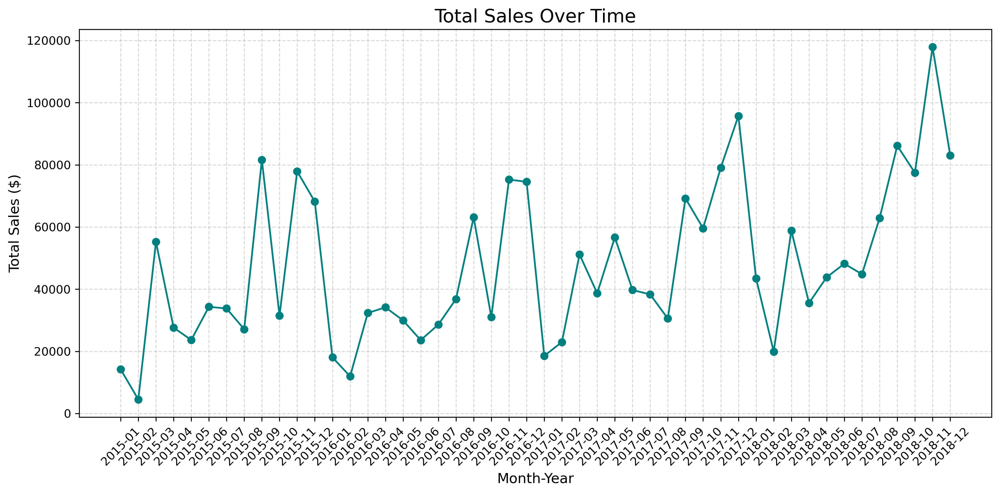
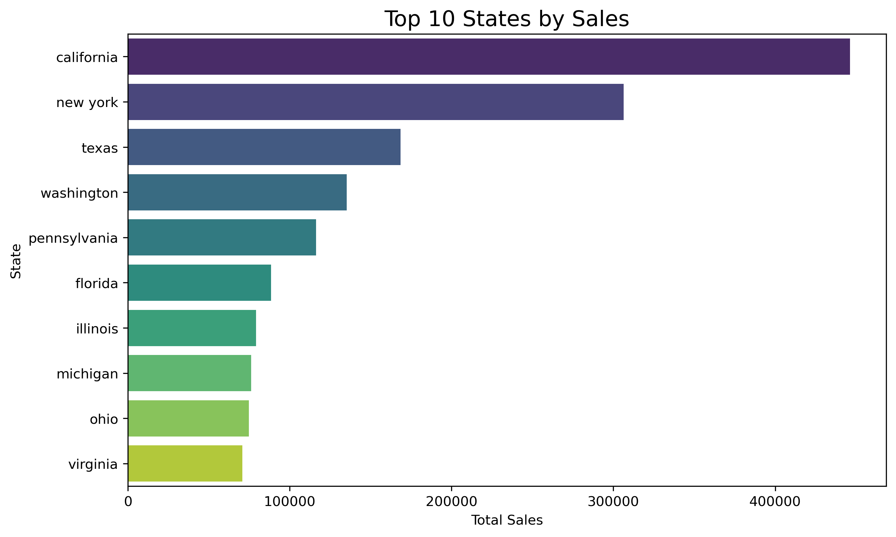
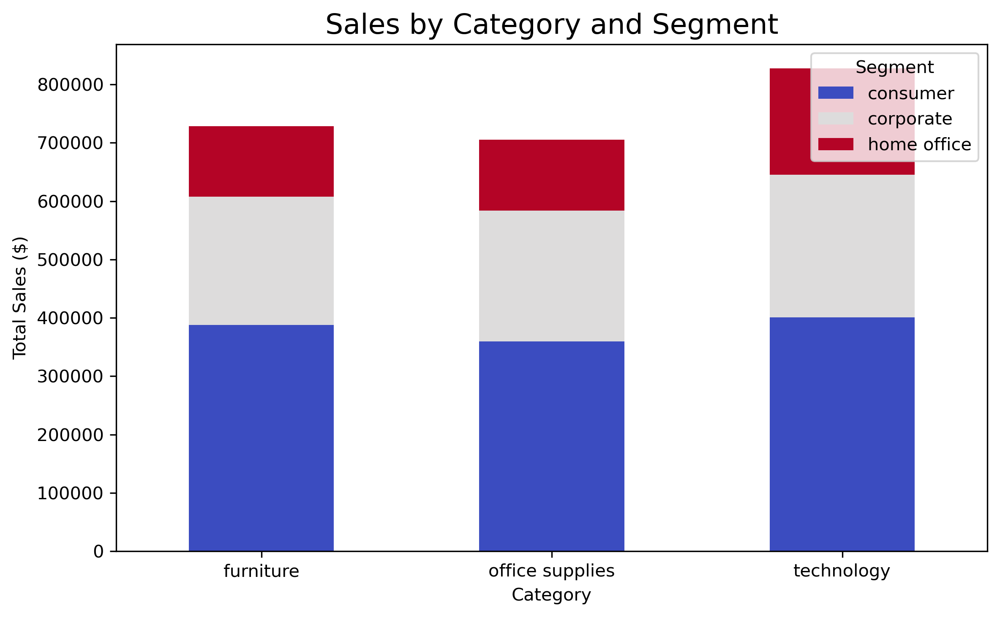

# Superstore Sales Data Analysis & Visualization

## Project Overview
This project explores the **Superstore Sales dataset** through **data cleaning, exploratory data analysis (EDA)**, and **visualization** to uncover sales trends, product performance, regional differences, and customer behaviors.  

The aim is to **transform raw sales data into actionable business insights** using Python’s data analysis and visualization libraries.

## Dataset
- **Source:** [Superstore Dataset](https://www.kaggle.com/datasets/vivek468/superstore-dataset-final)  
- **Period Covered:** 2015–2018  
- **Rows:** ~10,000 orders  
- **Columns:** Order details, product info, sales, profit, region, and customer data.

## Tools & Libraries
- **Python** (pandas, numpy)
- **Data Visualization:** matplotlib, seaborn
- **Notebook:** Jupyter Notebook

## Data Cleaning
- Removed duplicate entries
- Filled missing postal codes with random valid values
- Dropped irrelevant columns (`Row ID`)
- Converted date columns (`Order Date`, `Ship Date`) to datetime format

## Exploratory Data Analysis

### 1️. Time Analysis
- Monthly and yearly sales trends
- Peak sales months (notably November & December due to seasonal demand)

### 2️. Product Analysis
- **Top categories:** Technology & Office Supplies  
- Identified high-revenue sub-categories and low-performing items

### 3️. Geographic Analysis
- Regional sales distribution (West leads in revenue)
- Top 10 states by sales

### 4️. Customer Analysis
- Identified top customers by sales volume
- Observed purchasing patterns of repeat customers

## Key Insights
- **Technology** is the most profitable category
- Certain states **underperform** and could benefit from targeted promotions
- Seasonal spikes occur in **Q4**, especially December

## Recommendations
- Boost marketing in underperforming states
- Stock more high-demand products before Q4
- Develop loyalty programs for repeat customers

## Visualizations
  
  


## Project Structure
```plaintext
week3/
│   └── train.csv
│   └── data-visuals.ipynb
├── images/
│   ├── monthly_sales.png
│   ├── top_states.png
│   └── category_sales.png
└── README.md


 ```

## How to Run
1. Clone this repository:
    ```bash
       git clone https://github.com/debb-major/superstore-analysis.git
    ```
2. Install dependencies:
    ```bash
      pip install -r requirements.txt
    ``` 
3. Open the Jupyter Notebook:
   ```bash
    jupyter notebook notebooks/superstore_analysis.ipynb
    ```

## Author
### Deborah Olatona

**Medium**: [@devdebb](https://medium.com/@devdebb)

**LinkedIn**: [Deborah Olatona](https://www.linkedin.com/in/deborah-olatona)